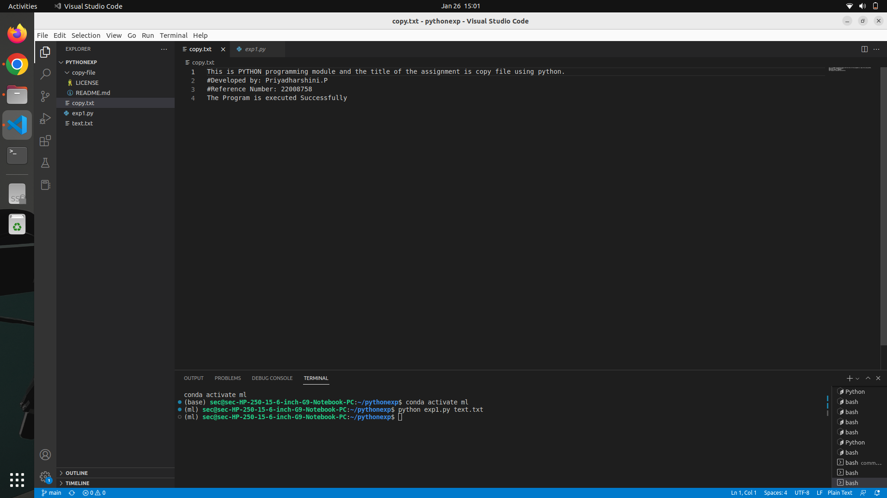

# Copy-file
## AIM:
To write a python program for copying the contents from one file to another file.
## EQUIPEMENT'S REQUIRED: 
PC
Anaconda - Python 3.7
## ALGORITHM: 
### Step 1:
Create two text file. A file which has content [text.txt] to be copied to the empty [copy.txt]file
### Step 2: 
Using write() function to copy the content from line.txt to empty file,text.txt
### Step 3: 
Save and run the python program in terminal
### Step 4:  
The text from the text.txt file is copied to the empty file copy.txt.
### Step 5: 
Then the text is shown in empty file copy.txt
### Step 6: 
The Result is obtained successfully
## PROGRAM:
``` python
#Developed by: Priyadharshini.P
#Reference Number: 22008758

with open('text.txt','r') as file1:
    with open('copy.txt','w') as file2:
        for line in file1:
            file2.write(line)
```
### OUTPUT:



## RESULT:
Thus the program is written to copy the contents from one file to another file.